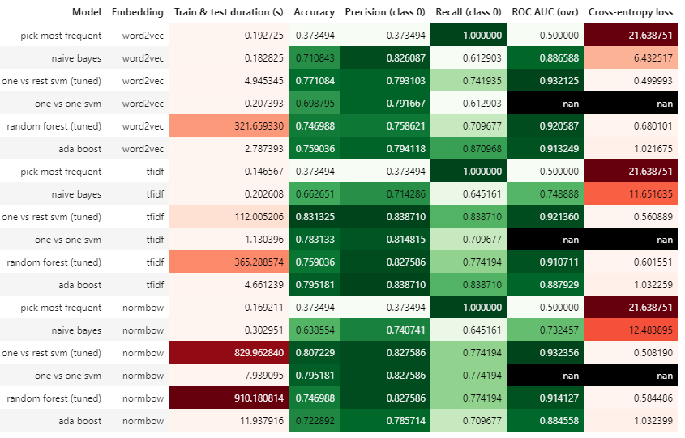
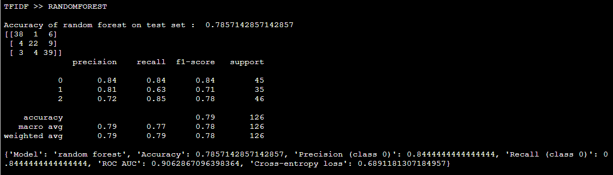

# cm-data-science

Hi all and welcome to the climate misinformation data science repo! 

Feel free to create your own branches and start playing around with the data that is stored in the labelled_data directory.

You will find text preprocessing and embedding pipeline in the text_preprocessing directory. 

In the models directory you will find the implementation of several models and their performance evaluation

Docker setup...
```
docker build -t cd-ds .
docker run --rm -it -p 8888:8888 -v "`pwd`":/data cd-ds
```

Model comparison...



"Best" model...

